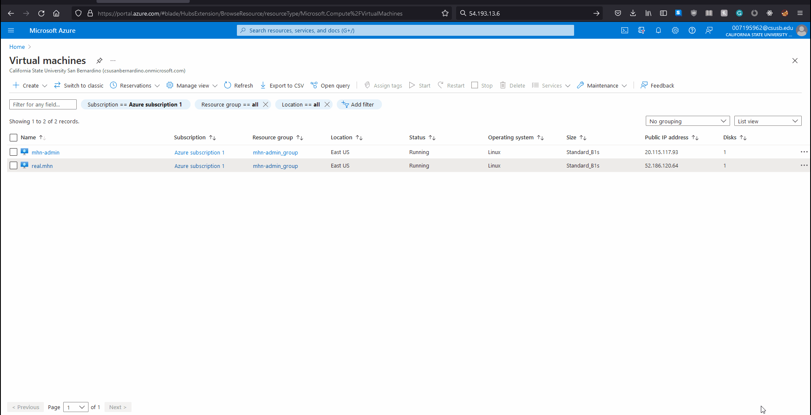
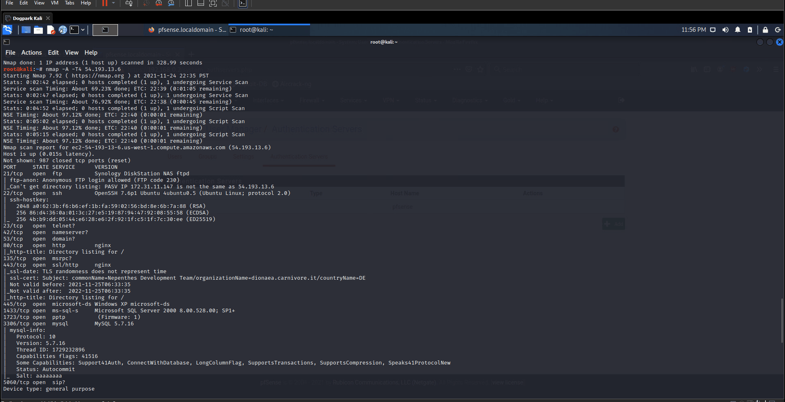

# Honeypot Assignment

**Time spent: 15 hours spent in total

**Objective:** Create a honeynet using MHN-Admin. Present your findings as if you were requested to give a brief report of the current state of Internet security. Assume that your audience is a current employer who is questioning why the company should allocate anymore resources to the IT security team.

### MHN-Admin Deployment (Required)

**Summary:** How did you deploy it? Did you use GCP, AWS, Azure, Vagrant, VirtualBox, etc.?

MHN admin machine is hosted on Azure while honeypot is hosted on AWS. The only modification I made to the network settings was to add incoming rules.

### Dionaea Honeypot Deployment (Required)

**Summary:** Briefly in your own words, what does dionaea do?

VM was exposed to internet due to Dinoaera's actions; Many ports were discovered to be open and exploitable by an NMAP scan. The goal is to get hackers to provide malware for analysis.

### Database Backup (Required) 

**Summary:** What is the RDBMS that MHN-Admin uses? What information does the exported JSON file record?

*Be sure to upload session.json directly to this GitHub repo/branch in order to get full credit.*

## Notes

Describe any challenges encountered while doing the assignment.
